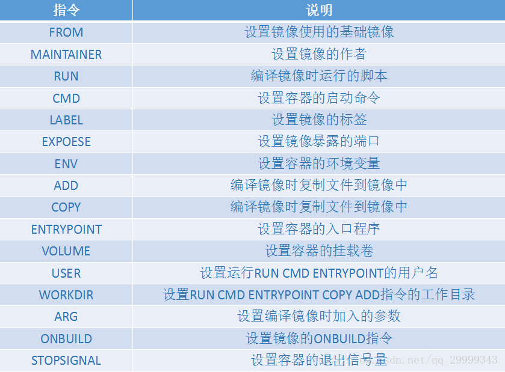

## 编译镜像
```shell
docker build -f ./Dockerfile-abc -t xxx:1.1 .
```
Docker Daemon从Dockerfile中顺序读取指令，生成一个临时容器，在容器中执行指令，容器编译成功后会提交作为镜像层加入最终镜像，为了加快编译过程，Docker Daemon采用了缓存机制，如果在缓存中找到了需要的中间镜像则直接使用该镜像而不生成临时容器（编译时可以使用选项–no-cache选择不使用缓存）

## Sending build context to Docker daemon 4.309 GB 数据很大问题
因为docker build . 这个点代表当前的上下文位置，会将当前所有文件一起打包。
### 解决1 
拷贝需要的文件到另一个文件夹打包
### 解决2
在Dockerfile同级目录下添加一个 .dockerignore 文件

## dockerfile指令图
