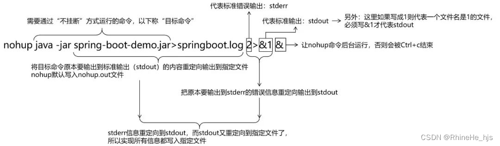

## linux
方式一： java -jar demo.jar
最常用的启动jar包命令，特点：当前ssh窗口被锁定，CTRL + C或关闭窗口，将打断程序运行，程序退出

方式二： java -jar demo.jar &
&代表在后台运行 ，CTRL + C后程序不会被终止，关闭SSH客户端连接，将终止程序

方式三： nohup java -jar demo.jar &
nohup 即 no hang up 不挂断 ，关闭SSH客户端连接，程序不会被终止
缺省日志输出目标文件情况下所有输出将被重定向到nohup.out的文件中

方式四：nohup java -jar demo.jar >outlog.log &
command >out.file 是将commandd 输出重定向到out.flie文件中，即输出内容不打印到屏幕上，而是输出到out.file文件中

方式五：nohup java -jar spring-boot-demo.jar > springboot.log 2>&1 &

## windows
命令行窗口 有些参赛需要加引号
start "badminton-server" javaw -jar "-Dfile.encoding=UTF-8" xxx.jar --spring.profiles.active=prod