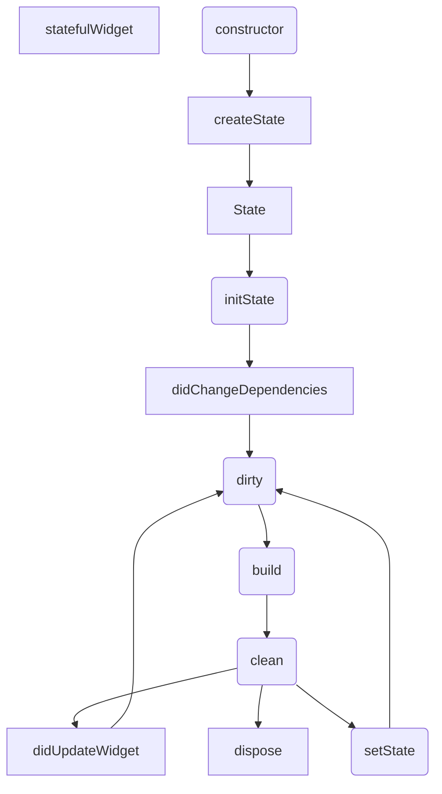

## statefulWidget生命周期

```
TB（Top Bottom）表示从上向下布局，另外三种是
BT
LR（Left Right）
RL
TD ?
```


|  名称   | 说明  |
|  ----  | ----  |
| createState  | 创建State，只执行一次 |
| initState  | 初始State，mounted等于true，只执行一次 |
| didChangeDependencies  | 父或祖先widget中的inheritedWidget改变时会被调用 |
| build  | ui重新渲染的时候多次执行(不要再build里更新状态，影响性能) |
| addPostFrameCallBack  | 渲染结束回调，只执行一次 |
| didUpdateWidget  | 父类setState后，子类就会触发 |
| deactivate  | 从组件树中移除State时调用 |
| dispose  | 组件被释放时调用 |

```dart
if(mounted == true){
    //是否挂载到组件树
}
```


