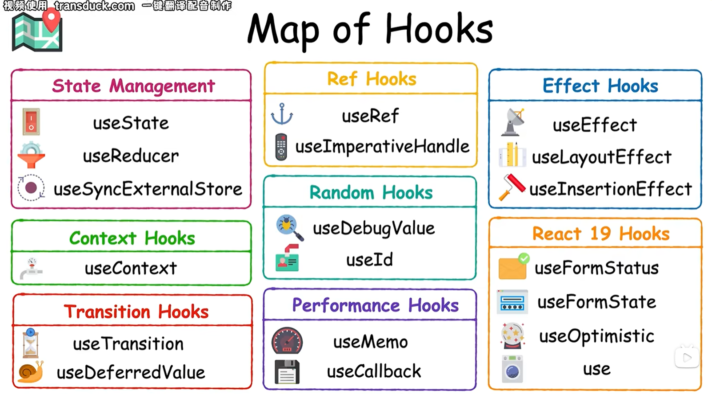

# Hooks

使用 hooks 时需要放在代码最顶层


## useState()

除非使用状态管理框架，不然使用最多
简单数据

```ts
const [age, setAge] = useState(18)
```

## useReducer()

复杂数据管理

```ts
const reducer = (state,action)=>{
  switch(action){
    case "increment":
      return state+1
  }
}

const [count,dispatch] = useReducer(reducer,0)
<button onClick={()=> dispatch('increment')} >Increment</>
```

```tsx
const formReducer = (state, action) => {
  switch (action.type) {
    case 'set_email':
      return { ...state, email: action.payload }
    case 'passwd':
      return { ...state, password: action.payload }
    default:
      return state
  }
}
const loginFormData = { email: '', password: '' }
const [state, dispatch] = useReducer(formReducer, loginFormData)

<Form>
  <Input type="email"
  onChange={(e)=>{
    dispatch({type:"email",payload:e.target.value})
  }}
  />
    <Input type="password"
  onChange={(e)=>{
    dispatch({type:"passwd",payload:e.target.value})
  }}
  />

</Form>
```

## useEffect()

```ts
//每次渲染后运行 ,空依赖数组 [] 表示副作用只会在组件挂载和卸载时执行一次。
useEffect(() => {}, [])
```

```ts
//根据依赖性更新
const [count,setCount] = useState(0)
useEffect(()=>{
  document.title = `you click ${count} times`
},[count])
//如果依赖性发生变化，就执行一次
<Button title='click' onClick={()=>setCount(count+1))/>

```

```ts
useEffect(() => {
  // 返回的函数是一个清理函数，用于在组件卸载前执行清理操作
  return () => {}
}, [])
```

## useQuery()

## useLayoutEffect()

渲染界面前执行

## useRef()

可以存任何值
可以记住数据但是不会触发重新渲染
useRef 的值可以直接改变；useState 的值不能直接改变，需要用 setXxx 方法

```ts
const ref = useRef(0)
const ref2 = useRef(0)
// use value on ref.current
```

## useMemo()

缓存以前的结果提高性能
仅当前依赖性发生更改时，useMemo 才会重新计算缓存的值
必须返回一个值，不像 useEffect 不用返回

```ts
function SumComponent({ numbers }) {
  const sum = useMemo(() => {
    return numbers.reduce((total, n) => {
      return total + n, 0
    })
  }, [numbers])

  return <Text> Sum:{sum} </Text>
}
```

```ts
const [songs,setSongs] = useState([...])
const filterSongs = useMemo((searchWord)=>{
  return songs.filter((song)=>{song.title.inclouds(searchWord)})
},[searchWord])
```

## useCallback()

也会记住传递给它的内容，**专门传递函数**，特别时传递给子组件的回调函数
**防止每次重新渲染又重新创建回调函数**来提高性能

```ts
const Counter = () => {
  const [count, setCount] = useState(0)
  const increment = useCallback(() => {
    setCount((c) => c + 1)
  }, [])

  return (
    <>
      <Text>{count}</Text>
      <Button onPress={increment} />
    </>
  )
}

//这里的<Button onPress={increment}/>相当于被包装
const Button = ({ onPress }) => {
  return <Button onPress={onPress} />
}
```

## useContext()

读取上下文值
只要有提供传递的值，无论有多深，都可以读取到

## useTransition() useDeferredValue()

## useSharedValue
