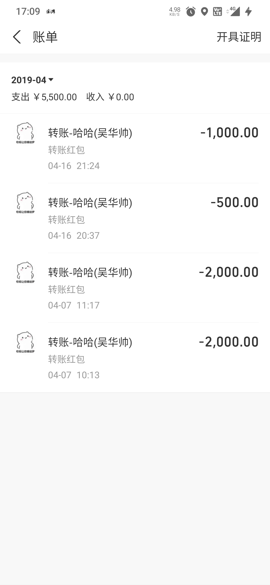

## 陈彩绿 （浙江人）

2020 年借 1.5 万未还，已失联。

## 吴华帅 （安徽人）

341225199401134914
安徽阜阳市阜南村黄岗镇张村东二队

2019 年借 5500 元

---

2025/5/6 还 500，还欠 2500
2025/5/6 还 1200，还欠 3000。（应该是法院公告送达了。对方在开庭前偿还了部分欠款，但未还清全部债务，您有权继续通过法律途径追讨剩余欠款。）
2024-8 还欠 4200
2023-11 还欠 4900
2023-8 还欠 5100
2023-4 还欠 5300
2019-4 欠我 5500 （向我借钱）

## 法院起诉流程及资料

最好要有对方的身份证（明确被告人）

- 资料
  - 调查取证申请书
  - 转账记录的电子回单
  - 民事起诉状
  - 聊天记录
    - 文字聊天记录（截图）
    - 语音聊天记录或通话录音作为证据需要刻录到光盘
  - 转账记录

### 转账记录的电子回单

（没有身份证信息情况下）用来调查对方的个人信息（姓名，身份证，联系方式，住址）
