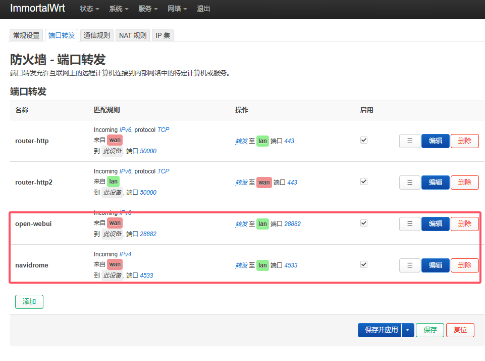
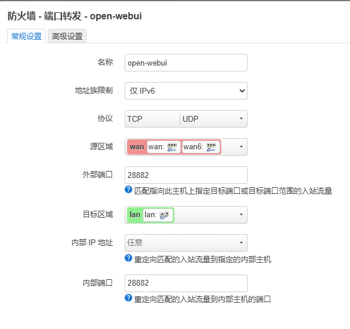

## 安装自签ssl证书

### 路由器安装nginx
系统->软件包  
直接安装nginx-full全编译版本
nginx -v # 查看nginx版本
nginx -V # 查看所有编译模块信息

### 生成自签ssl证书
```shell
ssh root@192.168.1.1 # 登录路由器
# 登录后
cd /etc/nginx
# 1 创建服务器证书密钥文件 server.key：
openssl genrsa -des3 -out server.key 2048
# 输入密码，确认密码，自己随便定义，但是要记住，后面会用到。
Enter PEM pass phrase: #qwer1234
Verifying - Enter PEM pass phrase: #qwer1234
# 2 创建服务器证书的申请文件 server.csr
openssl req -new -key server.key -out server.csr
# 这里要你填一些相关信息
Enter pass phrase for server.key: # 之前的密码
You are about to be asked to enter information that will be incorporated
into your certificate request.
What you are about to enter is what is called a Distinguished Name or a DN.
There are quite a few fields but you can leave some blank
For some fields there will be a default value,
If you enter '.', the field will be left blank.
-----
Country Name (2 letter code) [AU]:CN # 国家代号
State or Province Name (full name) [Some-State]:zhejiang # 省
Locality Name (eg, city) []:wenzhou # 市
Organization Name (eg, company) [Internet Widgits Pty Ltd]:MyCompany Corp # 公司名
Organizational Unit Name (eg, section) []: #可以不输入 
Common Name (e.g. server FQDN or YOUR name) []: #可以不输入 
Email Address []: #邮箱,随意

Please enter the following 'extra' attributes
to be sent with your certificate request
A challenge password []: #可以不输入 
An optional company name []: #可以不输入 

# 3备份一份服务器密钥文件
cp server.key server.key.bak
# 4去除文件口令
openssl rsa -in server.key.bak -out server.key
# 5生成证书文件server.crt 1825天
openssl x509 -req -days 1825 -in server.csr -signkey server.key -out server.crt

mkdir cert
mv server.key server.crt -t ./cert
```

-key    私钥文件（指明从哪个私钥文件中提取公钥创建证书签署请求）

-out    指定证书文件存放在位置

-new    生成新的证书签署请求；

-days n   证书有效时长，单位为“天”；

-x509    生成自签证书


### 配置nginx.conf文件
先在win弄好再复制进去
```conf
#user  nobody;
worker_processes  1;
#worker_processes  auto;
#pid /run/nginx.pid;
 
events {
    worker_connections  1024;
}

http {
    include       mime.types;
    default_type  application/octet-stream;

    sendfile        on;

    keepalive_timeout  65;
 
    gzip  on;

    ssl_certificate /etc/nginx/cert/server.crt;
    ssl_certificate_key /etc/nginx/cert/server.key;
    ssl_session_cache shared:SSL:32k;
    ssl_session_timeout 30m;
    ssl_ciphers ECDHE-RSA-AES128-GCM-SHA256:HIGH:!aNULL:!MD5:!RC4:!DHE;
    ssl_protocols TLSv1 TLSV1.1 TLSV1.2;
    ssl_prefer_server_ciphers on;
 
    server {
        # open-webui
        listen       [::]:28882 ssl;
        # listen       28882;
        # server_name openwrt2333ax6000.dynv6.net; #如果写了ip,server_name会失效;如果只写了端口,那么server_name会去匹配
        location / {
            proxy_pass http://192.168.1.142:28882;
        } 
    }

    server {
        # nas-navidrome
        listen       [::]:4533 ssl;
        location / {
            proxy_pass http://192.168.1.142:4533;
        } 
    }

    server {
        # nas-drawio
        listen       [::]:28888 ssl;
        location / {
            proxy_pass http://192.168.1.142:28888;
        } 
    }

    server {
        # nas-photopea
        listen       [::]:28887 ssl;
        location / {
            proxy_pass http://192.168.1.142:28887;
        } 
    }

    server {
        # nas-penpot
        listen       [::]:9001 ssl;
        location / {
            proxy_pass http://192.168.1.142:9001;
        } 
    }

    # server {
    #     # nas-xunlei
    #     listen       [::]:2345 ssl;
    #     location / {
    #         proxy_pass http://192.168.1.142:2345;
    #     } 
    # }
 
    # another virtual host using mix of IP-, name-, and port-based configuration
    #
    #server {
    #    listen       8000;
    #    listen       somename:8080;
    #    server_name  somename  alias  another.alias;
 
    #    location / {
    #        root   html;
    #        index  index.html index.htm;
    #    }
    #}
 
 
    # HTTPS server
    #
    #server {
    #    listen       443 ssl;
    #    server_name  localhost;
 
    #    ssl_certificate      cert.pem;
    #    ssl_certificate_key  cert.key;
 
    #    ssl_session_cache    shared:SSL:1m;
    #    ssl_session_timeout  5m;
 
    #    ssl_ciphers  HIGH:!aNULL:!MD5;
    #    ssl_prefer_server_ciphers  on;
 
    #    location / {
    #        root   html;
    #        index  index.html index.htm;
    #    }
    #}
 
}

# 路由器端的nginx没有stream模块?
# 安装nginx-mod-stream 配置文件再加入这句
load_module /usr/lib64/nginx/modules/ngx_stream_module.so;
stream {

    # win 远程桌面
    upstream mstsc {
        # 目标的ip端口,微软远程桌面默认是3389,可以自己修改下
        server 192.168.1.130:43389;
    }

    server {
        # 监听端口,这个是暴露出去的端口
        listen [::]:43385 ipv6only=on;
        # 代理到目标
        proxy_pass mstsc;
    }

    # win 远程桌面
    #upstream mstsc_ipv6 {
        # 目标的ip端口
        #server [2409:8a28:40cb:a6a0:E6E8:D2FF:FE94:541B]:43389;
    #}

    #server {
        # 监听端口
        #listen [::]:43385 ipv6only=on; #ipv6only=on 不占用ipv4端口？
        # 代理到目标
        #proxy_pass mstsc_ipv6;
        #proxy_pass [2409:8a28:40cb:a6a0:E6E8:D2FF:FE94:541B]:43389;
    #}
}
```

### 拷贝进路由器

```shell
# scp -O [你的nginx.conf路径] root@192.168.1.1:/etc/nginx/
scp -O nginx.conf root@192.168.1.1:/etc/nginx/
```
-O是传统模式
也可以用winscp工具拷贝进去

### nginx加载nginx.conf文件
```shell
nginx -c /etc/nginx/nginx.conf
nginx -s reload
```

### 路由器配置


之前在 网络->防火墙->通信规则 里创建的对应的端口规则可以弃用了

路由器安装nginx,再转发有问题