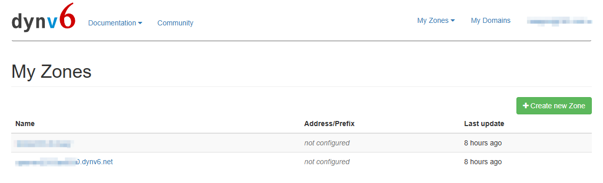

# 内网穿透_IPV6_DDNS

基于公网IPV6实现内网穿透  
路由器刷机版(复杂), 路由器不刷机(简易)两种方案.  

ipv6只能同样具有ipv6的设备访问,手机蜂窝网络在2015年已经普及ipv6,可以用手机测试

## 简易版  

### 1.光猫改桥接
光猫超管账号密码问装宽带的师傅,一般都给的,直接联系光猫上的师傅电话  
进入光猫后台  
如图: 网络->宽带设置->连接名称->"路由"改"桥接",其他默认即可,最好截图做个备份


### 2.路由器拨号
上网模式改PPPoE,填入自己的宽带账号密码  
ipv6开启,同时先关闭ipv6防火墙,下一步测试用,不然会ping不通

### 3.测试ipv6是否可用
- 1. 在系统设置->网络和Internet->当前连接的网络->找到本机的ipv6
- 2. [ping测试地址](https://ipw.cn/ipv6ping/),填入ipv6地址测试,没有显示PingFailed,而是显示测速数据就是成功了.

### 4.选择一个免费的子域名DDNS服务商
自己买也一个域名也可以  
这里就白嫖dynv6.net了
- 1.创建一个子域名

- 2.创建token(也可创建一个全局的token)


### 5.搭建ddns-go
可以选择本机或其他设备搭建.  
我一开始用自己的nas搭建ddns-go,图个方便(但是飞牛好像没有防火墙)  
- 1.docker 安装 ddns-go
- 2.进入ddns-go配置页面,地址: http://192.168.x.x:9876(会让你注册下管理员账号)
- 3.配置参考

#### dns服务商参数
- dns服务商选择CallBack
- URL填(注意换成自己的token):https://dynv6.com/api/update?zone=#{domain}&token=YOUR_TOKEN&ipv6=#{ip}  
#### ipv6配置
- ipv4启用去掉
- ipv6启用
- 获取ip方式通过网卡获取
- 正则匹配,看下ip(可能显示多个)是不是对的. 对的就留空(默认选第一个),不对就填 @2 ,(选择第二个)
- Domains: 自己的子域名
- 保存
- 查看日志或者dynv6查看是否有ip记录

## 路由器刷机版
路由器关闭防火墙后会将自己内网所有机器暴露到公网,非常不安全.  
所以必须开启防火墙,通过暴露个别端口访问,以及自己账号设置强密码方式,提升一点点安全.

### 光猫改桥接(同上)

### 路由器刷机
固件openwrt,版本最好选择23.05以上,否则有些功能没有  

### 路由器拨号
- 网络->接口->直接对wan进行编辑,填入宽带账号密码 ,保存并应用

### 固定ipv6地址,使用eui-64模式
由路由器分配内网设备地址,总是会变.  
ipv6地址是宽带下发前缀+设备地址组成,我们只要固定后4位地址即可.
#### 飞牛
```shell
nmcli connection show ## 查看ethernet的名称
```
```shell
sudo nmcli con modify "Wired connection 1" ipv6.addr-gen-mode eui64
systemctl restart NetworkManager
```
#### win
关闭随机生成Powershell命令（需管理员权限）：Set-NetIPv6Protocol -RandomizeIdentifiers Disabled  
关闭临时地址Powershell命令（需管理员权限）：Set-NetIPv6Protocol -UseTemporaryAddresses Disabled  
网络设配器禁用下，再启用生效

#### 固定后缀的DHCPv6地址
在OpenWRT中可以指定客户端的DHCPv6后缀，需要对需要开放端口的设备固定DHCPv6后缀
打开网络-DHCP/DNS-静态地址分配-新增，然后指定MAC地址和IPv6后缀即可，IPv6后缀是可以随意指定的


### 路由器防火墙设置
openwrt中的wan,代表外网;lan代表内网.  
从源区域:wan -> 目标区域:lan ,就是从外网到内网.
#### 网络->防火墙->端口转发
刷机前: 使用端口转发只能使用ipv4,而且路由器地址无法公网访问
刷机后: 配置端口转发,访问路由器公网地址和对应端口无法打开...
原来防火墙的通信规则优先于端口转发,既然通信规则添加规则后能直接访问ipv6设备,所以端口转发相对来说也没用了.如果是旧机器,没有ipv6地址,可以添加规则后再添加端口转发.
#### 网络->防火墙->通信规则

用自己的本地ipv6地址后4位+掩码  
其中/::ffff:ffff:ffff:ffff部分是掩码，写在目标地址的时候需要一并写入
```shell
# 如
::E6E8:D2FF:FE94:541B/::ffff:ffff:ffff:ffff
::6699/::ffff:ffff:ffff:ffff
```

路由器保存并应用,测试下

### 路由器安装ddns-go
在系统->软件包处
搜索ddns-go,点击luci-i18n-ddns-go-zh-cn这个汉化包,会把前面的那些包一起安装


#### 配置ddns-go

因为ddns-go装在路由器上,而我是把自己的nas映射到外网,需要获取nas设备的ip  
这里获取命令方式通过命令获取(不是100%有效),
```shell
INTERF=br-lan; SUFFIX="2e0:67ff:fe00:a209"; ip -6 addr show dev $INTERF | awk '/inet6/ && !/fe80::|deprecated/ {print $2}' | cut -d':' -f1-4 | sed "s/$/:$SUFFIX/"
```
INTERF 根据路由器lan的名称,没改过一般是br-lan,可以到网络->接口下查看,主要是通过br-lan获取到ipv6前缀地址;  
SUFFIX 要改成自己设备的ipv6后4位(哪台设备映射到外网就用哪个)  
这样就拼成一个完整的ipv6地址

## win远程桌面
目前是通过nginx做代理,因为nas已经装了nginx
nginx.conf配置加入
```shell
stream {

    # win 远程桌面
    upstream mstsc {
        # 目标的ip端口,微软远程桌面默认是3389,可以自己修改下
        server 192.168.2.50:43389;
    }

    server {
        # 监听端口,这个是暴露出去的端口
        listen 43385;
        # 代理到目标
        proxy_pass mstsc;
    }

    # win 远程桌面
    #upstream mstsc_ipv6 {
        # 目标的ip端口
        #server [2409:8a28:40cb:a6a0:E6E8:D2FF:FE94:541B]:43389;
    #}

    #server {
        # 监听端口
        #listen [::]:43385 ipv6only=on;
        # 代理到目标
        #proxy_pass mstsc_ipv6;
        #proxy_pass [2409:8a28:40cb:a6a0:E6E8:D2FF:FE94:541B]:43389;
    #}
}
```

## 加密
生成自签证书,路由器nginx转发不了,有nas的nginx转发
[参考生成ssl证书](./nginx-ssl自签证书.md)