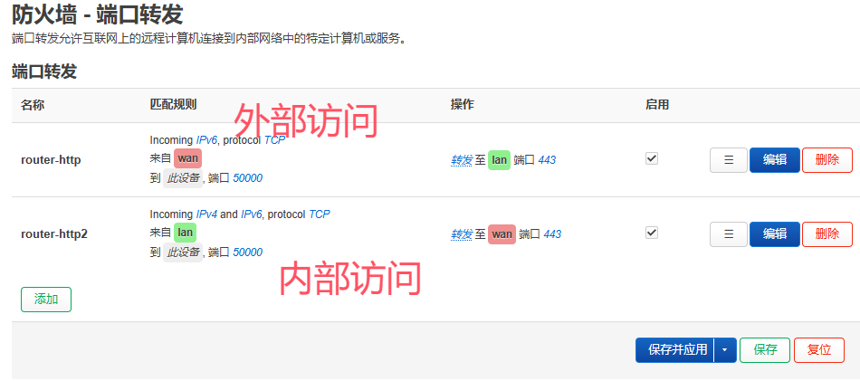
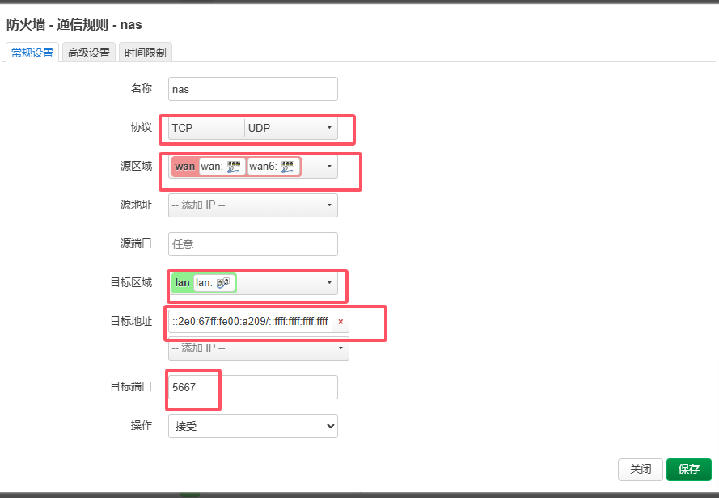

## 刷机
### 准备固件
### 获取stock


## 配置公网ipv6
### 安装ddns-go


ddns-go 通过命令获取设备前缀地址(已有后缀地址)
```shell
INTERF=br-lan; SUFFIX="2e0:67ff:fe00:a209"; ip -6 addr show dev $INTERF | awk '/inet6/ && !/fe80::|deprecated/ {print $2}' | cut -d':' -f1-4 | sed "s/$/:$SUFFIX/"
```

### uHTTPd
安装后进入,点击 删除旧证书和密钥 ,后刷新页面出来新的证书密钥.
简单的加密

### 防火墙
#### 端口转发
主要是访问路由器  
第一个从外部(公网)访问路由器  
第二个从内部访问


#### 添加通信规则
不关闭路由器防火墙的情况下,通过路由器访问内网设备

